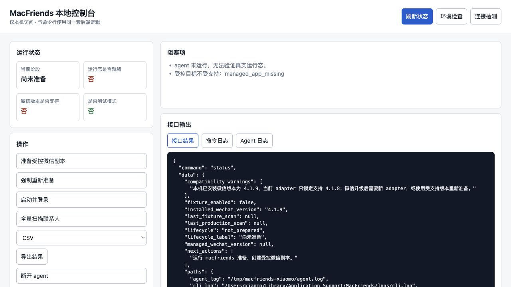
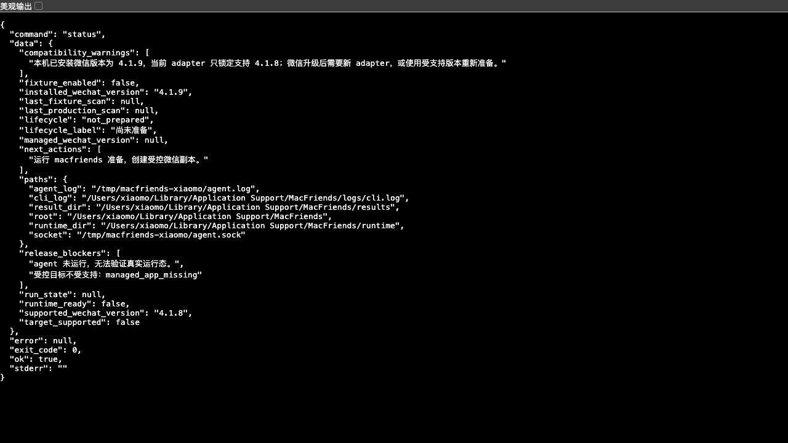

# MacFriends · macOS 微信好友关系检测 CLI

[](https://github.com/tytsxai/macfriends-cli/releases) · [llms.txt](llms.txt) · [Issues](https://github.com/tytsxai/macfriends-cli/issues) · [License: MIT](LICENSE)

> **关键词**:macOS 微信好友关系检测 · 微信单删检测 macOS · 微信清理僵尸粉 macOS · WeChat ghost contact macOS · Apple Silicon WeChat CLI · 受控副本 + Ad-hoc 签名 · Unix Domain Socket IPC · Rust + Objective-C++ agent
>
> **English**: A maintainability-first macOS CLI for inspecting WeChat (微信) friend relationships on Apple Silicon. Spawns a controlled, ad-hoc-signed copy of WeChat, attaches an Obj-C++ agent over UDS IPC, and exposes profile / contacts / scan primitives — with version gates, fixed error codes, Ready signals, and rollback paths. Designed to be scripted, not GUI-clicked.

MacFriends 是一个**独立维护的 macOS 微信好友关系检测 CLI 工具**，面向 Apple Silicon，聚焦本地运行、受控启动、结果导出与生产可运维能力。

项目定位：
- Rust CLI + Objective-C++ agent
- 仅面向 macOS / Apple Silicon
- 当前锁定 `WeChat 4.1.8 (arm64)`
- 生产运行态实际附着在 `WeChatAppEx 2.4.1.19024`
- 本地运行，不依赖云端服务
- 强调 Ready 门禁、可诊断、可回滚、可维护

## 当前能力

本仓库已经提供：
- 完整 CLI：`doctor` / `status` / `prepare` / `launch` / `attach` / `profile` / `contacts` / `scan` / `export` / `detach` / `cleanup` / `serve`
- 中文优先使用体验：命令说明、Web 控制台、状态标签、操作文档均面向中文用户；常用命令提供中文别名
- 本地 Web 控制台：`macfriends serve --open` 或 `macfriends 控制台 --open`，提供状态总览、操作按钮、日志查看和 HTTP API
- 单版本 adapter manifest：`WeChat 4.1.8 + arm64 + signature_scan`
- 受控副本准备、ad-hoc 签名、Unix Domain Socket IPC、结果导出
- 版本门禁、target status 持久化、运行态 Ready 门禁、固定错误码
- `--json` 成功/失败统一结构化输出、CLI/agent 日志轮转
- fixture 端到端 smoke、扫描结果留存上限、安装原子替换
- `prepare --force` 会刷新仓库内最新 native 资产，并清理历史运行目录残留
- 本地安装脚本、回滚备份位与发布打包脚本

## 界面截图

下面两张截图展示了 MacFriends 的主要产品形态，便于搜索 `macOS 微信好友关系检测`、`微信单删检测 macOS`、`WeChat friend checker CLI`、`WeChat ghost contact macOS` 的用户快速判断项目是否适合自己。

### 中文本地控制台

中文本地控制台截图：展示 `macfriends 控制台 --open` 启动后的本机 Web UI，可直接查看运行状态、微信版本兼容提示、阻塞项，并执行准备、启动、扫描、导出、断开和清理等操作。



### 状态 API 与兼容提示

状态 API 截图：展示 `/api/status` 返回的结构化 JSON，包括 `lifecycle_label`、`supported_wechat_version`、`installed_wechat_version`、`compatibility_warnings`、`release_blockers` 和下一步建议，适合脚本、自动化或二次开发使用。



## 上线判断

只有当 `doctor --json` 或 `attach --json` 同时满足以下条件，才可视为达到生产 Ready：
- `runtime_ready=true`
- `fixture_enabled=false`
- `release_blockers=[]`

若目标不满足 bundle/version/arch 条件，命令会明确失败，错误码固定为：
- `version_mismatch`
- `adapter_not_loaded`
- `resolver_validation_failed`
- `profile_primitive_unresolved`
- `contacts_primitive_unresolved`
- `scan_primitive_unresolved`
- `rpc_timeout`

## 目录

- `crates/cli`：命令行、配置、导出、IPC 客户端
- `native/agent`：macOS agent 动态库、受控宿主、版本 adapter
- `docs`：架构、兼容性、安装、排障、运维文档
- `fixtures`：锁定版本 adapter 模板
- `scripts`：安装与打包脚本

## 快速开始

```bash
cargo build
make -C native/agent artifacts
cargo run -p macfriends -- doctor
cargo run -p macfriends -- status
cargo run -p macfriends -- prepare
cargo run -p macfriends -- launch --login
cargo run -p macfriends -- attach
cargo run -p macfriends -- serve --open
```

## 安装与发布

```bash
make install-local
make package
```

详细说明见 `docs/install.md` 与 `docs/operations.md`。

中文用户建议先看 [docs/中文用户指南.md](docs/中文用户指南.md)。

## 命令

```bash
macfriends doctor
macfriends status
macfriends prepare [--source-app /Applications/WeChat.app] [--force]
macfriends launch --login
macfriends attach
macfriends profile
macfriends contacts
macfriends scan --all
macfriends export --format json
macfriends export --format csv
macfriends detach
macfriends cleanup
macfriends serve [--addr 127.0.0.1:8765] [--open]
```

常用中文别名也可直接使用：

```bash
macfriends 状态
macfriends 准备
macfriends 启动 --login
macfriends 连接
macfriends 扫描 --all
macfriends 导出 --format csv
macfriends 控制台 --open
```

## 版本策略

### 支持矩阵（v0.1.0）

| 组件 | 支持值 | 来源 |
| --- | --- | --- |
| 架构 | `arm64`（Apple Silicon） | `fixtures/adapter.wechat-macos-arm64.json` |
| WeChat bundle | `com.tencent.xinWeChat` | adapter manifest |
| WeChat 版本 | **`4.1.8`** | adapter `build_target` |
| 运行态 WeChatAppEx | `2.4.1.19024` | adapter |
| 实现 | `signature_scan` | adapter `adapter_name` |

新版本支持需要更新 `fixtures/adapter.wechat-macos-arm64.json` 并重新解析原语，不会自动跟进。

### 版本不匹配时怎么办

如果 `prepare` / `doctor` 报 `reason=version_mismatch`，按以下顺序处理：

1. **确认当前微信版本**：
   ```bash
   defaults read /Applications/WeChat.app/Contents/Info CFBundleShortVersionString
   ```
2. **降级到 4.1.8**：
   - 历史版本需要自行从 4.1.8 时期的本地备份 / Time Machine 快照 / 第三方旧版镜像取得 —— 本仓库不分发任何 WeChat 安装包
   - 卸载现有微信前先备份 `~/Library/Containers/com.tencent.xinWeChat/`
   - 安装 4.1.8 后再次跑 `macfriends prepare`
3. **不愿降级**：等待本仓库发布新版本 adapter，或自行 fork 更新 `fixtures/adapter.wechat-macos-arm64.json` 中的 `build_target` 并重做原语解析（见 `docs/compatibility.md`）。

- 若源微信版本与目标不匹配，`prepare` 会记录 `target-status.json`，后续 `attach/profile/contacts/scan` 将明确失败

## 本地 Smoke Test

fixture 模式只用于测试和 CI，不属于默认用户路径：

```bash
make -C native/agent artifacts
MACFRIENDS_AGENT_SOCKET="$HOME/Library/Application Support/MacFriends/runtime/agent.sock" \
MACFRIENDS_ADAPTER_PATH="$PWD/fixtures/adapter.wechat-macos-arm64.json" \
MACFRIENDS_ENABLE_FIXTURE=1 \
DYLD_INSERT_LIBRARIES="$PWD/native/agent/build/libmacfriends_agent.dylib" \
"$PWD/native/agent/build/macfriends-host"
```

另一个终端执行：

```bash
cargo run -p macfriends -- attach
cargo run -p macfriends -- profile
cargo run -p macfriends -- contacts
cargo run -p macfriends -- scan --all
```

## 生产发布门槛

```bash
make ready
cargo run -p macfriends -- doctor --json
cargo run -p macfriends -- launch --login --json
cargo run -p macfriends -- attach --json
```

`make ready` 会执行 `cargo fmt --check`、`cargo clippy --all-targets --all-features -- -D warnings`、测试、fixture smoke、构建与打包。

若 `primitive_resolution` 仍是 `unresolved`，则说明核心真实原语尚未闭环，项目仍不可上线。

## 日常使用闭环

`macfriends status` 是日常入口，会一次性展示：
- 当前生命周期：`not_prepared` / `prepared` / `running_blocked` / `ready`
- 本机微信版本、受控副本版本、当前 adapter 锁定版本和兼容提示
- 受控进程 PID、运行态 Ready、fixture 状态、release blockers
- 最近一次生产扫描与 fixture 扫描摘要
- 结果目录、CLI 日志、agent 日志、socket 路径
- 下一步动作建议

推荐路径：

```bash
macfriends status
macfriends prepare
macfriends launch --login
macfriends attach
macfriends scan --all
macfriends export --format csv
```

CSV 导出会对可能被表格软件识别为公式的昵称、备注等字段做中和处理，降低本地打开导出文件时的误执行风险。

## 本地 Web 控制台

```bash
macfriends serve --open
# 或
macfriends 控制台 --open
```

控制台默认监听 `127.0.0.1:8765`，只服务本机浏览器。页面按钮调用同一个 CLI 后端，不维护第二套业务逻辑。

可用接口包括：
- `GET /api/status`
- `GET /api/compatibility`
- `GET /api/doctor`
- `GET /api/attach`
- `GET /api/profile`
- `GET /api/contacts`
- `GET /api/logs?kind=cli|agent`
- `POST /api/prepare`
- `POST /api/launch`
- `POST /api/scan`
- `POST /api/export`
- `POST /api/detach`
- `POST /api/cleanup`

详细说明见 `docs/web-console.md`。

## FAQ

**Q:能不能像「测一测谁删了我」那样用?**
原始数据(contacts + scan)拿到后,这种判断你自己做,工具不替你解释。

**Q:会改我装的微信吗?**
不会。`prepare` 在 runtime 目录里拷一份**受控副本**并 ad-hoc 重签名,启动的是副本,`/Applications/WeChat.app` 完全不动。

**Q:微信升级了怎么办?**
当前 manifest 锁死在 4.1.8(arm64)。升级后这工具会直接报 `version_mismatch` —— 这是**有意为之**的安全围栏。新版本需要更新 `fixtures/adapter.wechat-macos-arm64.json`。

**Q:Intel Mac 行不行?**
不行。只支持 Apple Silicon。

**Q:`primitive_resolution=unresolved` 是什么意思?**
核心读取原语还没闭环。看到这个的版本**不要**上生产。

**Q:怎么判断能上生产?**
`doctor --json` 或 `attach --json` 同时满足 `runtime_ready=true` + `fixture_enabled=false` + `release_blockers=[]`。

## 许可

MIT，见 `LICENSE`。

## Star History

[](https://www.star-history.com/#tytsxai/macfriends-cli&Date)
